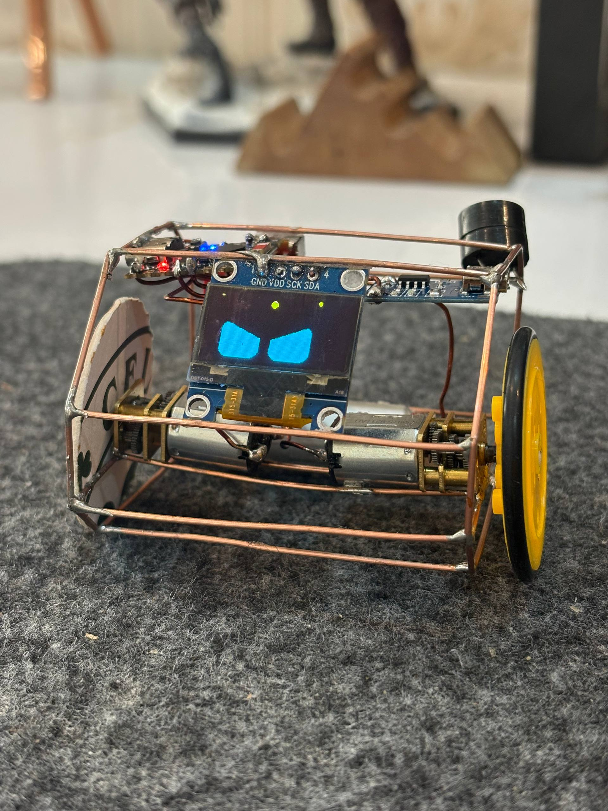
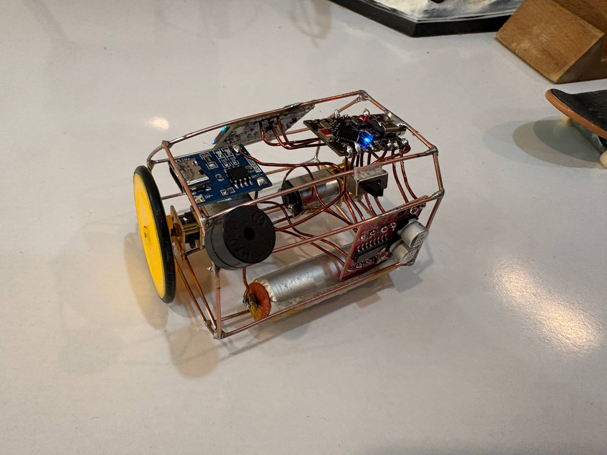

# MOCHAN Robot

MOCHAN is a small ESP32-based desk robot with animated OLED "robo-eyes", two drive
motors, a buzzer for sound effects and melodies, and a built-in Wi-Fi access point
that serves a phone-friendly web control panel. No internet or app is required — the
robot creates its own Wi-Fi network and a captive web page.

## Gallery

| | |
| --- | --- |
|  |  |

Videos:

- [Demo video 1](media/IMG_6353.MOV)
- [Demo video 2](media/IMG_6358.MOV)

## Features

- **Animated eyes** on a 128×64 SSD1306 OLED using the [FluxGarage RoboEyes](https://github.com/FluxGarage/RoboEyes) library (moods, blinking, idle look-around, winks, confused/laugh animations, sweat and curiosity toggles).
- **Drive control** for two motors via a TB6612-style driver (forward, back, left, right, plus individual wheel pulses).
- **Web control panel** served over a self-hosted Wi-Fi access point with a captive-portal redirect.
- **Auto / idle behavior modes** — `SLEEP` (still), `WIGGLE` (soft random motion), and `CURIOUS` (more active random motion).
- **Auto-Personality** mode that cycles moods, activity level, and occasional sounds over a 5-minute loop.
- **Sound effects & melodies** — chirp, giggle, purr, and built-in tunes (startup, Mario coin, Nokia, Star Wars). Includes a mute toggle.
- **Clock mode** showing a large digital clock on the OLED, settable from the web UI (auto-syncs to your phone's time) or toggled with a physical button.
- **Dice roll mini-game** with a rolling animation on the OLED.

## Hardware

- ESP32 board (uses `esp_random()` and `ledcAttach`/`ledcWriteTone`, so an ESP32 with the modern Arduino-ESP32 v3.x core).
- SSD1306 128×64 I2C OLED display.
- Dual motor driver (TB6612FNG or similar) with `STBY` standby control.
- Passive buzzer.
- Momentary push button (optional) for toggling clock mode.

### Pin assignments

| Function           | GPIO |
| ------------------ | ---- |
| OLED SDA           | 8    |
| OLED SCL           | 9    |
| Motor LF           | 1    |
| Motor LB           | 0    |
| Motor RF           | 2    |
| Motor RB           | 3    |
| Motor STBY         | 10   |
| Buzzer             | 5    |
| Clock button       | 4    |

> **Note:** GPIOs 0, 1, 2, 3 are used for the motors and 5, 8, 9, 10 are otherwise
> taken. The clock button uses GPIO 4 with the internal pull-up enabled — wire the
> button between the pin and GND. Choose a different free GPIO if 4 is unavailable on
> your board.

## Dependencies

Install these Arduino libraries (via the Library Manager or manually):

- `Adafruit SSD1306`
- `Adafruit GFX` (dependency of SSD1306)
- `FluxGarage RoboEyes` — `FluxGarage_RoboEyes.h` is included in this repo.

You also need the **ESP32 Arduino core (v3.x)** installed through the Boards Manager.

## Build & flash

1. Open `mochan.ino` in the Arduino IDE.
2. Select your ESP32 board and port under **Tools**.
3. Install the dependencies listed above.
4. Click **Upload**.

## Usage

1. Power on the robot. It plays a short startup melody and shows its eyes.
2. On your phone or computer, connect to the Wi-Fi network named **`MOCHAN`** (open, no password).
3. A captive portal should open automatically, or browse to any address (e.g. `http://192.168.4.1`) to load the control panel.
4. Use the on-screen controls:
   - **Direction pad** — drive the robot (UP / DOWN / LEFT / RIGHT / STOP).
   - **Mode** — SLEEP / WIGGLE / CURIOUS idle behavior.
   - **Mood & expressions** — set mood, trigger animations, toggle sweat/curiosity.
   - **Sound** — mute toggle.
   - **Dances** — Wiggle, Spin, Happy routines.
   - **Sounds** — play built-in melodies.
   - **Auto-Personality** — let the robot run its own mood/activity cycle.
   - **Clock mode** — show a digital clock; set the time or sync from your device.
   - **Dice** — roll a virtual die shown on the OLED.

The physical button (GPIO 4) toggles clock mode on/off.
